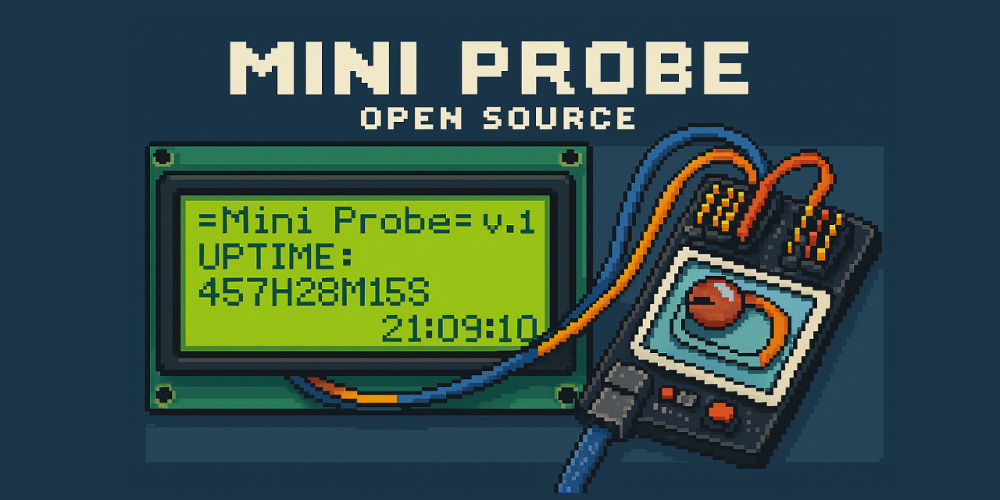

# Mini Probe

mini-probe is an open-source project designed to display real-time operational status of home devices (e.g., NAS) on an electronic screen, making it easy to visualize critical information even for headless devices.

## Features

- **Real-time Monitoring**: Displays uptime, memory usage, network traffic, disk usage, and other device status information.
- **Hardware Compatibility**: Supports development boards such as Arduino UNO and NodeMCU, along with IIC 2004 LCD and IIC 1602 LCD screens.
- **Dynamic Updates**: Refreshes screen content dynamically, supports scrolling text for content exceeding screen width.

## Hardware Requirements

- **Development Board**: Arduino UNO, NodeMCU, or other compatible microcontrollers.
- **LCD Screen**: IIC 2004 LCD or IIC 1602 LCD.
- **Connecting Wires**: Data cables for connecting the development board and LCD screen.

## Software Requirements

- **Arduino IDE**: For writing and uploading firmware.
- **Docker**: Required on the monitored device to run the data collection service.

## Installation and Configuration

1. **Hardware Connection**:
   - Connect the LCD screen to the development board via the I2C interface.
   - Ensure correct connection: SDA pin to A4 and SCL pin to A5 (Arduino UNO example).

2. **Firmware Upload**:
   - Open the `lcd-info-scroll.ino` file in Arduino IDE.
   - Select your development board and the corresponding port.
   - Click "Upload" to flash the firmware onto the board.

3. **Deploying Data Collection Service**:
   - On the monitored device, deploy the data collection service using Docker. Refer to the project's `docker-compose.yml` file for detailed steps.
   - Ensure the service runs correctly and communicates with the development board.

## Usage

- After powering on the development board, the LCD screen will automatically display the operational status of your device.
- For content exceeding screen width, the system automatically scrolls the display.
- Adjust display content or refresh frequency through modifications in the firmware code.

## Resources

- Project Repository: [https://github.com/soulteary/mini-probe](https://github.com/soulteary/mini-probe)
- Related Tutorial: [Light Up the Status: Setting Up a Home NAS Electronic Monitoring Screen at Low Cost](https://soulteary.com/2025/04/09/light-up-the-status-a-few-costs-to-get-home-nas-electronic-monitoring-screen.html)

## License

This project is open-sourced under the GPL-3.0 license. For details, refer to the LICENSE file.
